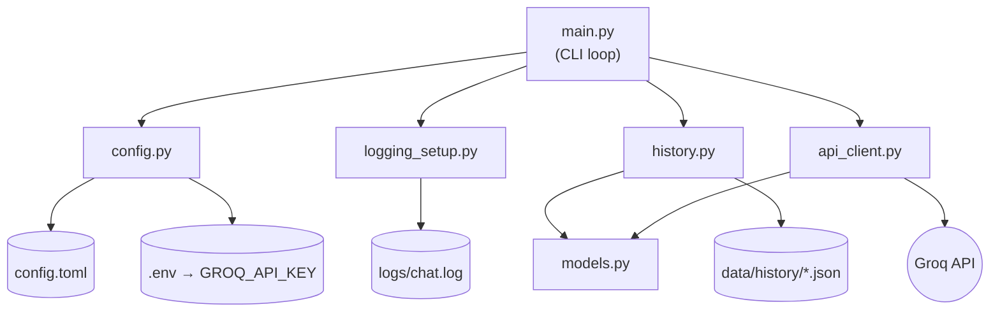
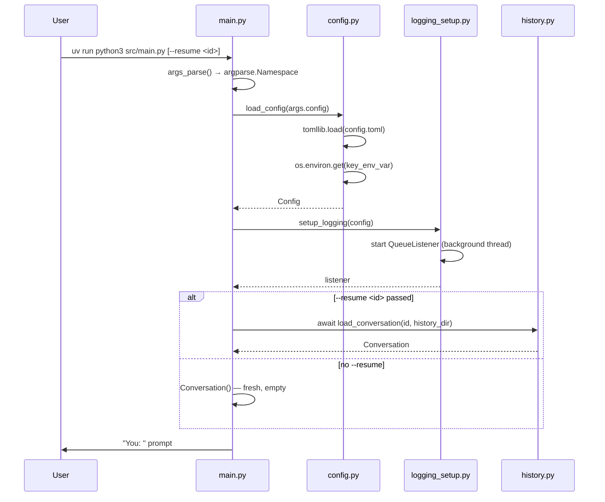
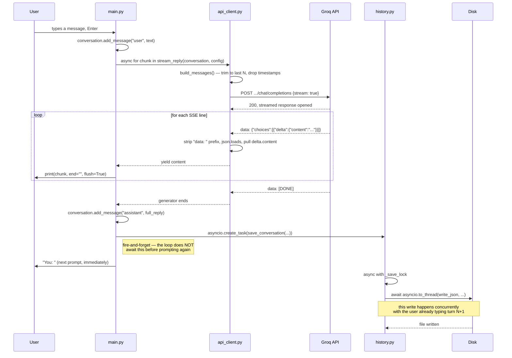
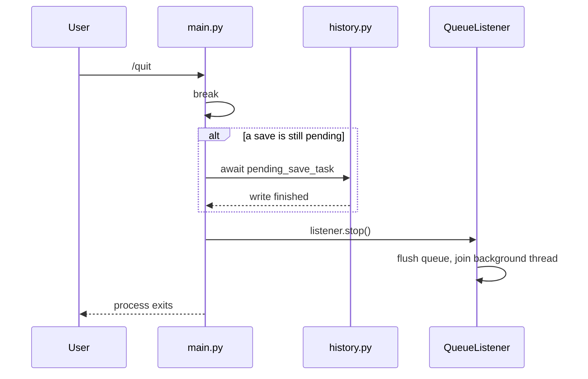
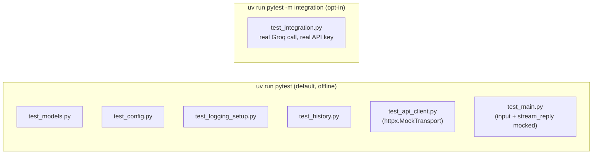

# First AI Chat — Architecture

How the pieces fit together, and what actually happens on disk, over the network, and across threads/tasks during a run.

**Contents**
- [Overview](#overview)
- [Module map](#module-map)
- [Startup sequence](#startup-sequence)
- [A chat turn, in detail](#a-chat-turn-in-detail)
- [Command handling](#command-handling)
- [Shutdown sequence](#shutdown-sequence)
- [The concurrency model](#the-concurrency-model)
- [Testing strategy](#testing-strategy)

## Overview

First AI Chat is a terminal chat client that streams responses from Groq's OpenAI-compatible API. It was built specifically to practice four async Python patterns: **streaming I/O** (`httpx` + `async for`), **fire-and-forget background work** (`asyncio.create_task`), **offloading blocking calls** (`asyncio.to_thread`), and **coordinating shutdown** across a task and a background logging thread.

Six modules, each with one job:

| Module | Responsibility |
|---|---|
| `models.py` | `Message` / `Conversation` — plain data, JSON-serializable |
| `config.py` | Load + validate `config.toml`, resolve the API key from the environment |
| `logging_setup.py` | Non-blocking (queue-based) logging to `logs/chat.log` |
| `history.py` | Async save / load / list of conversations as JSON on disk |
| `api_client.py` | Build the Groq request, stream and parse the SSE response |
| `main.py` | The CLI loop: input, commands, streaming turn, autosave, shutdown |

## Module map



## Startup sequence



## A chat turn, in detail

This is the core of the app — and the reason `stream_reply` is an **async generator** rather than a function that returns a string. The reply is printed token-by-token as it arrives, and the conversation is saved in the background while the user is already free to type the next message.



If the Groq call fails (bad key, timeout, rate limit), `main.py` catches `httpx.HTTPStatusError` / `httpx.TimeoutException` / `httpx.RequestError` around the `async for`, logs it, prints a one-line error, and `continue`s — no assistant message is added and no save is scheduled for that turn.

## Command handling

Every command (`/quit`, `/history`, `/save`, `/clear`, `/load`) must end in either `break` or `continue` — otherwise the command text itself falls through and gets sent to Groq as a chat message. (This was the single most common bug during development — several rounds of review caught commands silently leaking into the API call.)

```mermaid
flowchart TD
    Start([read input, strip]) --> Empty{empty?}
    Empty -- yes --> Start
    Empty -- no --> Slash{starts with "/"?}

    Slash -- no --> Chat[add user message<br/>stream_reply → Groq]
    Chat --> Autosave[create_task: save in background]
    Autosave --> Start

    Slash -- yes --> Which{command}
    Which -- /quit --> Break([break out of loop])
    Which -- /history --> H[list_conversations + print] --> Cont[continue]
    Which -- /save --> S[await save_conversation] --> Cont
    Which -- /clear --> C[conversation = Conversation-empty] --> Cont
    Which -- /load --> L{id found?}
    L -- yes --> Cont
    L -- no, FileNotFoundError --> LE[print: no conversation found] --> Cont
    Which -- unrecognized --> U[print: unknown command] --> Cont
    Cont --> Start
```

## Shutdown sequence

Two things need a clean handoff on exit: any autosave still in flight, and the logging background thread.



## The concurrency model

Four distinct async patterns are used, deliberately kept separate so each is easy to point at:

| Pattern | Where | Why |
|---|---|---|
| `async for` over a streaming response | `api_client.stream_reply` | Prints tokens as they arrive instead of waiting for the full reply |
| `asyncio.create_task` (fire-and-forget) | `main.py`, after each turn | Autosave runs *without* blocking the next prompt |
| `asyncio.to_thread` | `history.write_json` / `load_json` | Offloads blocking disk I/O so it doesn't stall the event loop |
| `asyncio.Lock` | `history._save_lock` | Prevents two concurrent saves from interleaving writes to the same file |

Notably absent (on purpose): `asyncio.gather` for true parallel requests — the app only ever makes one Groq call per turn. A natural next exercise would be a `/compare` command that sends the same prompt to two models concurrently with `gather` and prints both.

## Testing strategy



The default suite never touches the network — `api_client` tests replace the transport layer with `httpx.MockTransport`, and `main.py` tests mock `input()` and `stream_reply` directly so the whole command-dispatch/loop logic is exercised without any I/O. The one live test is gated behind a `pytest` marker and skipped automatically if `GROQ_API_KEY` isn't set, so it never runs by accident in an environment without credentials.
